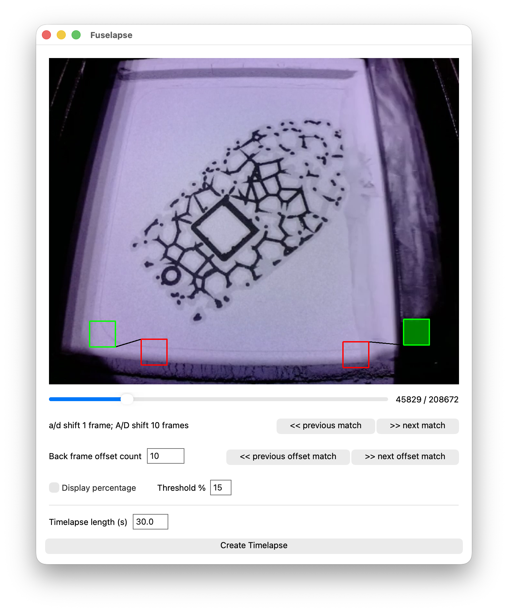

#  Fuselapse

An unofficial application for generating smooth timelapse videos from a Formlabs Fuse series 3D printer.

https://github.com/user-attachments/assets/6833d253-9724-4b90-8c14-e7c0da02bb88

> [!IMPORTANT]
> This project is concerned with post-processing recorded video clip, not recording or downloading the video itself. Before using this utility, you will have to have already acquired a video of your print job. The best way to do this is to screen record (using Panopto, OBS, or similar) the Preform live video feed during the print job.
>
> For the best results, make sure to record at 30fps or higher, and record at 720p or higher. I recommend cropping the video to just the print area, but I suppose this is not strictly necessary.

## The approach

More information is available at the bottom, but the general approach is to define a "region of interest" on each side of the print area to detect the presence of the doser as it travels across. The detection is a simple color-based approached by gathering the average hsl color of the region and comparing the luminance with a threshold. As the black doser travels across the frame, the luminance will drop below the threshold.

## User guide

1. *Before using Fuselapse* Record a full print job using a screen recording software to capture the live video feed in PreForm. Make sure to record at 30fps or higher, and record at 720p or higher.
2. *Before using Fuselapse* Crop the video to just the print area for the best result video. This is not strictly necessary, but you probably don't want the PreForm UI in the video. You also should trim the video to just the print job, removing any pre-print or post-print footage.
3. *Before using Fuselapse* Download the latest version of Fuselapse from the [releases](https://github.com/jackcrane/fuselapse/releases) page or clone the source.
4. Launch Fuselapse either by running the executable or running `python3 main.py` from the source.
5. You will be prompted to select the input video file. Select the video you recorded in step 1 and optionally cropped in step 2.

6. The defaults should work fine for most videos, but you can adjust the regions of interest and threshold percentage if it is not properly matching. See below for instructions on how to do this.
7. Verify frame identification is working by clicking on <kbd>\>\> next offset match</kbd> a few times. You should see the video progress to the next layer being done, with the doser not being present in the frame.
8. Set your goal timelapse length, and click <kbd>Create Timelapse</kbd>. It will take a few minutes to process, and then you will have a timelapse video of your print job.

## Adjusting settings

The procedure for adjusting settings is as follows:

1. Load in the video as normal.
2. Scrub to the second frame of the doser traveling across the print area from right to left. Make sure the right-most green box has the semi-transparent green fill, and the red box connected to it does not have a fill.
3. Let the video progress until the doser is traveling across the print area from left to right. Do the same thing as above, just with the left-most boxes.
4. If you notice the doser is behind the green box, but it did not fill in green, then the threshold percentage is too low. Turn on "Display percentage" and modify the threshold percentage until it accurately fills in the box when the doser is present, and does not fill in when the doser is elsewhere.
5. We use the red boxes as "block" checkers... If the green box matches and the red box also fills in, we do not trigger that frame. You can use this to
6. The way we identify the frames to save relies on identifying when the doser becomes present in a box, but we do not want the doser to be visible in the timelapse. As such, we actually use a frame that is a few frames before the doser is detected. If you are noticing the doser visible in the timelapse, increase the "Back frame offset count". The default is 10.
